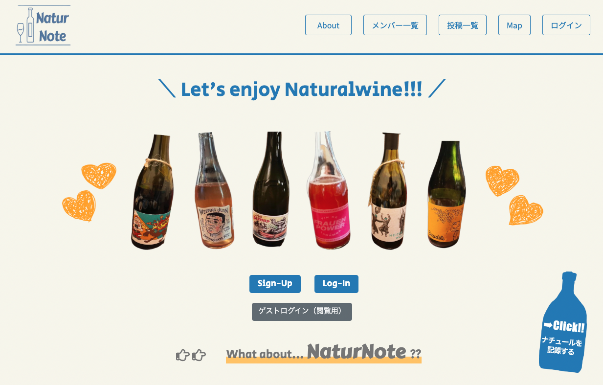
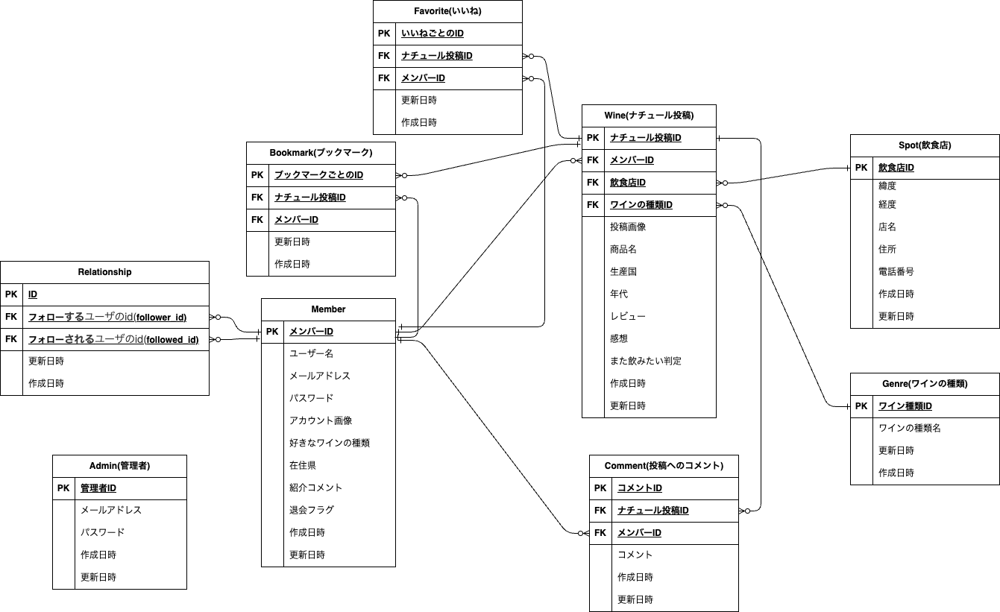

# NaturNote(ナチュールノート)

### トップ画面

### URL
http://54.168.194.130/  
**一般ユーザー**   
新規会員登録、もしくはゲストログインをご利用ください。  
※ゲストログインのデータは一定時間経過すると削除されます。
**管理者用**   
メールアドレス:admin@admmin
パスワード:adminadmin
管理者用ログインURL: /admin/sign_in 

## サイト概要
自分の飲んだナチュラルワインのラベル写真を投稿し、記録していくことができるアプリです。  
飲んだ店名（場所）も一緒に投稿し、mapにピンを立てていくことで、どの飲食店でナチュラルワインが飲めるのか調べることができます。
また、他のユーザーの投稿に対してリアクションをすることができます。

### サイトテーマ
ナチュラルワインの記録アプリ・・・自然派ワイン(Naturalwine) × 記録(Note) = NaturNote

### テーマを選んだ理由
  "健康"は誰もが関心を示すテーマであり、**"オーガニック"**や**"生産者の顔が見える"**といった食品に対して昨今多くの人が興味・関心・こだわりを持っています。
  そんな中、ブドウの栽培から醸造までできるだけ自然につくられ、生産者の想いを感じることができる**"ナチュラルワイン（自然派ワイン）"**を好む人が増えてきています。  
  また、ナチュラルワインのラベルは生産者の個性を表現するため、思わず写真に撮りたくなるような個性的でデザイン性溢れているものが多く、
SNSに投稿されたワインのラベルデザインを見て惹かれたことがきっかけとなり、ナチュラルワインに興味を持つ方も増えてきています。

私もナチュラルワイン好きのひとりですが、下記のような悩みを抱えていました。   
　- 「身近にナチュラルワイン好きな人が少なく、思いを共有できない。」
　- 「どこでナチュラルワインが楽しめるのかが分からない。」
また、ワインとの出会いは一期一会であるため、   
  - 「飲んだワインの素敵なラベルを記録に残したい。」 
という思いを持っている方も多いと思います。  
 そこで、①自分の飲んだナチュラルワインのラベルの記録 ②同ナチュラルワイン好きの方との交流 ③ナチュラルワインを楽しめる飲食店探し.   
上記３点ができるアプリがあれば、よりナチュラルワインを楽しめるのではないかと思い、このアプリを制作しました。

### ターゲットユーザ
- ナチュラルワインが好きな人
- ナチュラルワインのことをもっと知りたい人
- ナチュラルワインを取り扱っている飲食店探しをしたい人

### 主な利用シーン
- ナチュラルワインを飲んだ時
- ナチュラルワインについて知りたいなと思っている時
- ナチュラルワインを楽しめる飲食店を調べたい時

## 実装機能一覧
|    |  機能  |  gem / 備考  |
| ---- | ---- | ---- |
|  1  |  ユーザー/管理者(ログイン機能) |  devise  |
|  2  |  ゲストログイン機能  |  ×  |
|  3  |  コメント機能  |  Ajax(非同期)  |
|  4  |  フォロー機能  |  Ajax(非同期)  |
|  5  |  いいね機能 |  Ajax(非同期) |
|  6  |  ブックマーク機能 |  Ajax(非同期) |
|  7  |  タブ機能 |  Ajax(非同期)  |
|  8  |  5段階評価機能  |  Raty  |
|  9  |  住所検索・Map機能  |  Google MapAPI、Geocoding API  |
|  10  |  ユーザー検索機能  |  Ransack  |
|  11  |  定時処理機能 (ゲストユーザーデータ自動削除）  |  whenever   |
|  12  |  画像サイズ調整機能  |  image_processing  |
|  13  |  ページネーション機能  |  kaminari、'bootstrap5-kaminari-views', '~> 0.0.1'  |
|  14  |  rails/devise日本語化 |  rails-i18n |
|  15  |  レスポンシブ対応 |  Bootstrap |
|  16  |  アイコン導入 |  FontAwesome |

## 設計書
### ER図

### テーブル定義書
https://docs.google.com/spreadsheets/d/1SYGTK0zK4FWmsrQ7IXT0MSyBQLI5YpgI-mqA3OP61Ko/edit#gid=857942792
## 開発環境
- OS：Linux(CentOS)
- 言語：HTML,CSS,JavaScript,Ruby,SQL
- フレームワーク：Ruby on Rails
- JSライブラリ：jQuery
- IDE：Cloud9

## 使用素材
- About画面(ブドウの写真).  
   photoACフリー写真・・・https://www.photo-ac.com/